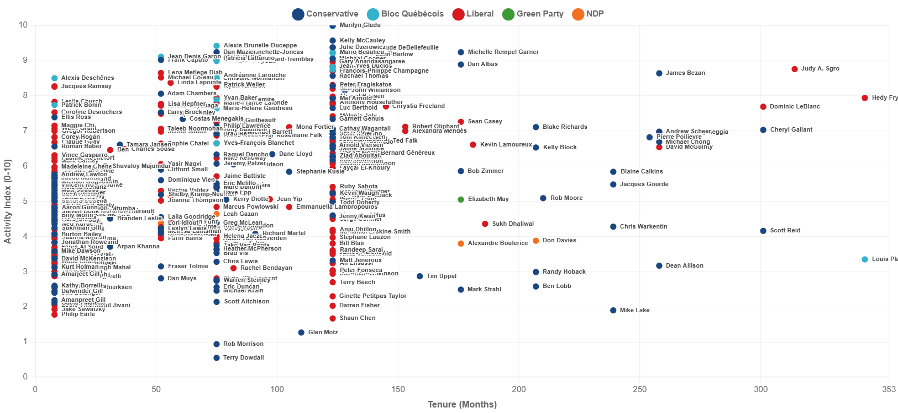
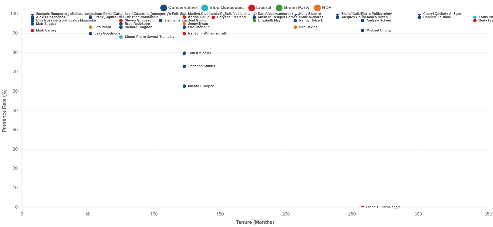
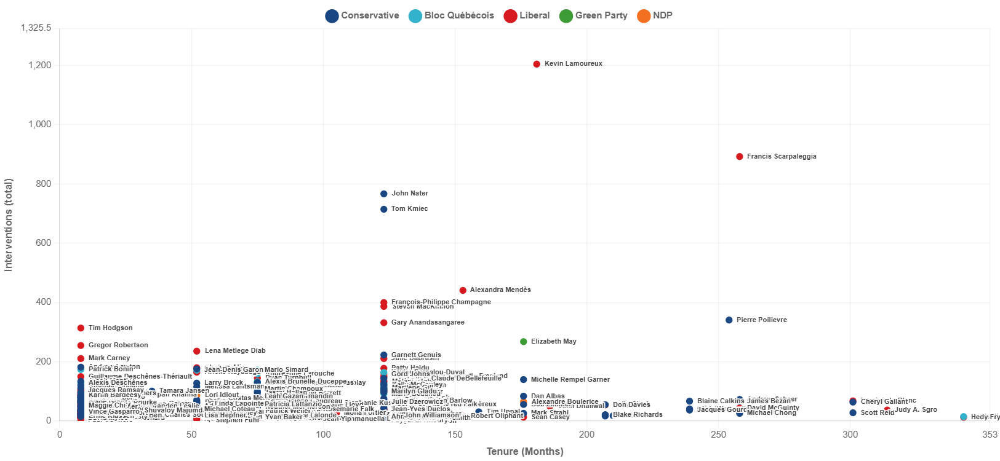
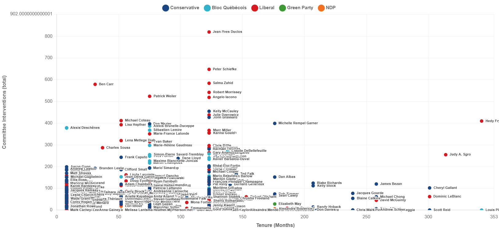
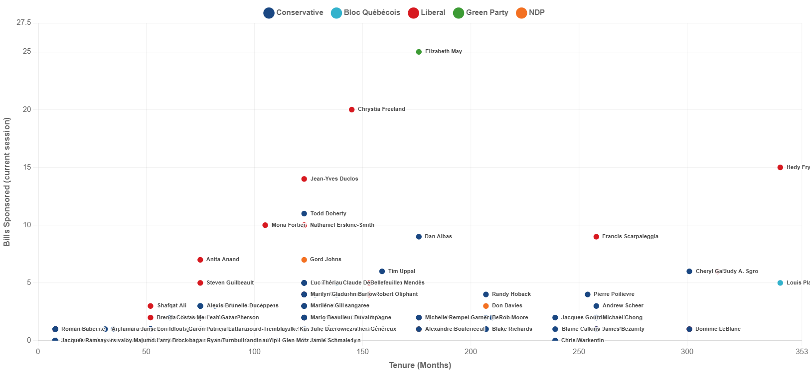
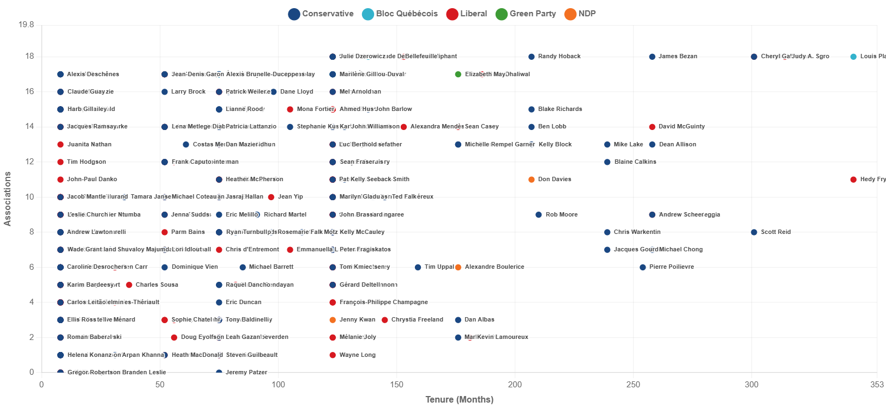

# Parliament Analytics Dashboard

**Canadian Parliament member analytics with voting participation, activity metrics, and comparative analysis.**

## Data Source

This project uses data from **[xBill - Parliamentary Tracker](https://xbill.ca/)**, which scrapes data from the House of Commons website every few hours. xBill provides comprehensive parliamentary data including bills, votes, debates, member profiles, and more.

- **Website**: https://xbill.ca/
- **API Documentation**: https://xbill.ca/api-docs
- **Data Coverage**: Bills, votes, vote casts, member profiles, interventions (debates), committee work

---

## What This Project Does

The Parliament Analytics Dashboard performs three main functions:

1. **Data Extraction (ETL)**: One-time pull of select xBill API data into MongoDB
	 - Members (profiles, election history, roles, committees)
	 - Votes and individual member vote casts
	 - Parliamentary interventions (floor debates)
	 - Committee interventions
	 - Bills introduced

2. **Metric Computation**: Generate derived analytics metrics stored in MongoDB
	 - Voting participation rates
	 - Activity index scores (composite engagement metric)
	 - Rankings and percentiles (overall and within-party)
	 - Comparative statistics by party and province

3. **Web Presentation**: Serve data via REST APIs and interactive HTML/JavaScript visualizations
	 - Sortable, filterable member table
	 - Individual member profiles with detailed metrics
	 - Scatter plot explorer for comparative analysis

**See**: `docs/METRICS_DOCUMENTATION.md` for complete methodology and metric definitions

---

## Web Pages

The dashboard includes two main pages:

### 1. Member List Table (`/`)

**URL**: http://localhost:3000 (or your configured port)

**Features**:
- Sortable columns (click header to sort by any metric)
- Filter by party and province
- Shows all 343 House members
- Displays: Name, Party, Province, Presence %, Activity Index, Leadership Score, Tenure, Interventions, Committee Work, Bills, Committees, Associations
- Click any row to view detailed member profile
- Deep-linkable: pass `?id=personId` in URL to auto-load a member profile

---

### 2. Member Profile Page (`/member.html`)

**URL**: http://localhost:3000/member.html

**Features**:
- Searchable MP dropdown (alphabetically sorted, House members only) with live filtering
- Comprehensive metric display: activity index, leadership score, presence rate, tenure, bills, committees, associations
- Full rank and percentile information (overall + in-party)
- Detailed sections: All Positions & Roles, Committee Memberships, Election History, Caucus Roles, Associations (with role mapping fallbacks)
- Comparison to party and provincial averages with clear ✓ Above / ✗ Below indicators
- Deep-linkable: pass `?id=personId` to auto-load a specific member

---

### 3. Scatter Plot Explorer (`/scatter.html`)

**URL**: http://localhost:3000/scatter.html

**Features**:
- Scatter plots comparing tenure against key metrics
- Interactive zoom and pan (per-chart reset button)
- Hover on data points to see member details
- Click data points to open detailed profile modal
- Color-coded by political party
- **Export**:
	- Individual chart export: "💾 Export PNG" button (next to zoom reset)
	- Batch export all charts: "📊 Export All Charts as PNG" button below filters
	- Exported PNGs use chart title as filename (kebab-case) and white background
- Inline filter layout (Parties and Provinces on single rows with inline Reset buttons; wraps on narrow screens)

**Available Charts**:
1. **Tenure vs Activity Index** — Composite engagement score (updated weights)
2. **Tenure vs Presence Rate** — Vote participation percentage
3. **Tenure vs Leadership Score** — Position-based leadership metric
4. **Tenure vs House Intervention Counts** — Floor debates and speeches
5. **Tenure vs Committee Intervention Counts** — Committee meeting contributions
6. **Tenure vs Bills Sponsored** — Legislative initiative
7. **Tenure vs Committees** — Committee memberships
8. **Tenure vs Associations** — Parliamentary association memberships

---

**See**: `METRICS_DOCUMENTATION.md` for complete methodology, design decisions, and all metric definitions

---

## Tech Stack

| Component | Technology |
|-----------|-----------|
| **Application Server** | Node.js + Express |
| **Data Storage** | MongoDB |
| **Data Source** | xBill REST API |
| **Frontend** | HTML5, JavaScript, Chart.js |
| **Visualization** | Chart.js with zoom/pan plugins |

---

## Usage Workflow

### Step 1: Start Server (Keep Running)

Launch the Express API server and web UI:

```bash
npm start
```

**What it serves:**
- Web UI: http://localhost:3000 (or your configured port)
- REST APIs for member metrics
- Compute endpoint for analytics generation

**Note:** Keep this terminal running. Open a new terminal for steps 2 and 3.

---

### Step 2: Run ETL (One-Time or Periodic)

Fetch fresh data from xBill API and populate MongoDB:

```bash
npm run etl
```

**What it does:**
- Syncs members, votes, vote casts, bills, interventions, and committee interventions
- Filters to House members only (excludes Senate)
- Handles rate limiting with automatic backoff
- **Duration**: ~5-10 minutes

**Environment variables (optional):**
```bash
# Override parliament/session (default: 45/1)
PARLIAMENT=45 SESSION=1 npm run etl
```

---

### Step 3: Compute Member Stats

Process raw MongoDB data into analytics metrics:

```bash
npm run compute
```

**What it does:**
- Calculates tenure, activity metrics, and rankings
- Generates activity index scores (0-10 scale)
- Computes percentiles (overall + within-party)
- Stores results in `member_stats` collection
- **Duration**: ~5 seconds

**Requires:** Server must be running from step 1

**Environment variables (optional):**
```bash
PARLIAMENT=45 SESSION=1 SERVER_URL=http://localhost:3000 npm run compute
```

---

## Project Structure

```
parliament-dashboard/
├── README.md                   # This file
├── METRICS_DOCUMENTATION.md    # Complete metric methodology
├── package.json                # Dependencies and npm scripts
├── .gitignore                  # Excludes archive/, logs, node_modules
├── etl-server.js               # ETL: sync data from xBill API
├── compute-stats.js            # Trigger member stats computation
├── server.js                   # Express server + APIs + static files
├── public/
│   └── html/
│       ├── index.html          # Member list table
│       ├── member.html         # Member profile (unused standalone)
│       └── scatter.html        # Scatter plot explorer

---

## Data Coverage

**Source**: xBill API (https://xbill.ca/api)  
**Parliament**: 45th Parliament of Canada  
**Session**: 1st Session  
**Members**: 343 House members (Senate excluded from analytics)  
**Votes**: 59 divisions  
**Vote Casts**: 24,861 individual MP votes  
**Interventions**: ~25,148 floor debates  
**Committee Interventions**: ~5,630 committee meeting records  
**Bills**: 125 bills introduced in session  

---

## Chart Gallery

Tap any thumbnail to open the full-size export.

<table>
	<tr>
		<td><a href="chart_image_exports/tenure-vs-activity-index.png"></a></td>
		<td><a href="chart_image_exports/tenure-vs-house-presence-rate.png"></a></td>
	</tr>
	<tr>
		<td><a href="chart_image_exports/tenure-vs-leadership-score.png"></a></td>
		<td><a href="chart_image_exports/tenure-vs-house-intervention-counts-total.png"></a></td>
	</tr>
	<tr>
		<td><a href="chart_image_exports/tenure-vs-committee-intervention-counts-total.png"></a></td>
		<td><a href="chart_image_exports/tenure-vs-bills-sponsored.png"></a></td>
	</tr>
	<tr>
		<td><a href="chart_image_exports/tenure-vs-committees.png"></a></td>
		<td><a href="chart_image_exports/tenure-vs-associations.png"></a></td>
	</tr>
</table>

---

## License

ISC

---

## Contributing

Issues and pull requests welcome on GitHub.

---
